# Provenance Guard - Project Planning Specification

### MILESTONE 1 ###

## ## Architecture

### System Flow Narratives
* **Submission Flow (`POST /submit`):** When a piece of text-based content is submitted along with a creator ID, it is captured by the system endpoint and passed simultaneously into two distinct detection signal functions. 
    * The first signal passes the text to the Groq API (`llama-3.3-70b-versatile`) to evaluate holistic semantic patterns, while the second signal executes local Python logic to evaluate mechanical stylometric properties (sentence length variance). 
    * Both signals return numerical metrics which are aggregated by a centralized confidence scoring pipeline. This calculated confidence value determines which of three user-facing transparency text labels is generated. 
    * Finally, a unique content ID is generated, a structured row is written into an immutable SQLite/JSON audit log database, and the results are returned as a JSON payload to the user.
* **Appeal Flow (`POST /appeal`):** If a creator disputes a classification, they hit the appeal endpoint with the original unique content ID and their written justification. 
    * The backend system locates the corresponding entry within the audit log, modifies its validation status field from "classified" to "under review," logs the creator's raw explanation text directly alongside the initial records, and returns a confirmation to the client.

### Data Flow Diagram

```text
1. Submission Lifecycle (POST /submit)
=====================================================================================
[Raw Text Input] ──> ( POST /submit Route )
                            │
                            ├───> [Signal 1: Groq LLM Semantic Sweep] ───┐
                            ├───> [Signal 2: Stylometric Math Engine] ───┼─> [Scoring Engine]
                            │                                                     │
                            ▼                                                     ▼
              [Structured Audit Log DB] <─── [Generate UX Copy Label] <─── [Combined Score]
                            │
                            ▼
                    [JSON API Response]

2. Appeal Lifecycle (POST /appeal)
=====================================================================================
[Creator Reason] ──> ( POST /appeal Route ) ──> [Fetch Content ID] ──> [Set Under Review]
                                                                              │
                                                                              ▼
                                                                  [Update Audit Log DB]

```

### ALTERNATIVE DATA FLOW DIAGRAM

```mermaid
graph TD
    %% Submission Flow
    subgraph Submission Lifecycle [POST /submit]
        A[Raw Text Input & Creator ID] --> B(POST /submit Route)
        B --> C[Signal 1: Groq LLM Semantic Sweep]
        B --> D[Signal 2: Stylometric Math Engine]
        C -->|Score: 0.0 - 1.0| E[Combined Confidence Scorer]
        D -->|Score: 0.0 - 1.0| E
        E -->|Aggregated Score| F[Transparency Label Generator]
        E -->|Metrics & Timestamp| G[(Structured Audit Log DB)]
        F -->|UX Text Label| H[JSON API Response]
    end

    %% Appeal Flow
    subgraph Appeal Lifecycle [POST /appeal]
        I[Content ID & Creator Reasoning] --> J(POST /appeal Route)
        J --> K[Fetch Match from DB]
        K --> L[Update Status to 'under review']
        L --> M[(Append Appeal to Audit Log DB)]
        M --> N[JSON Confirmation Response]
    end

    style Submission Lifecycle fill:#f9f9f9,stroke:#333,stroke-width:1px
    style Appeal Lifecycle fill:#f5f5f5,stroke:#333,stroke-width:1px
``` 

### Detection Signals
* **Signal 1: LLM Semantic Evaluator (Groq API) ***
    * What it measures: High-level structural coherence, cliché semantic transitions, formatting predictability, and repetitive phrase structures.
    * Why it differs: Large language models produce tokens based on optimized statistical probability, which naturally manifests as hyper-polished, grammatically conventional prose with low perplexity.
    * Output Format: A calibrated float value between 0.0 (Highly Confident Human) and 1.0 (Highly Confident AI), extracted via structured JSON parsing from the Groq prompt completion.
    * Blind Spot: Highly formal, dry academic writing or rigid corporate business updates authored by humans can mirror these hyper-predictive token distributions, inadvertently causing false-positive AI flags.  
* **Signal 2: Stylometric Heuristic Engine (Pure Python)**
    * What it measures: Sentence Length Variance (SLV). The system parses the raw text into individual sentences, counts the tokens per sentence, and computes the statistical variance ($\sigma^2$) across the dataset.  
    * Why it differs: AI text generators default to uniform pacing with highly consistent, mid-length sentences. Conversely, human writers naturally vary sentence length dynamically—interspersing short, punchy statements with winding, complex compound clauses.  
    * Output Format: A normalized float value between 0.0 and 1.0. High variance maps closer to 0.0 (human), while hyper-uniform sentence lengths map closer to 1.0 (AI).
    * Blind Spot: Humans writing strict, repetitive technical documentations, instruction guides, or highly rhythmic poetry with fixed meter lengths will display unvaried sentence geometry, tricking the heuristic into an AI classification.  

* **Signal Combination & Calibration Logic**
    * To determine the final composite confidence score, the backend will compute a weighted average of both independent signals:
    * $$\text{Final Score} = (\text{Groq Score} \times 0.65) + (\text{Stylometric Score} \times 0.35)$$
    * The Groq semantic evaluator is given a higher weight due to its holistic contextual comprehension. However, because false positives are uniquely damaging to human creators on creative platforms, a high stylometric variance score (indicating erratic, human-like structure) will act as a dampening buffer to suppress borderline AI verdicts. 

### MILESTONE 2 ###

## ## Uncertainty Representation

### Score Mapping Logic
The system converts the continuous scalar output $\text{Final Score} \in [0.0, 1.0]$ into categorical bins that prioritize mitigating high-consequence false positives (flagging human work as AI). 
* **Scores from 0.00 to 0.35** indicate significant structural variance and human-like semantic features, resulting in a **High-Confidence Human** classification.
* **Scores from 0.36 to 0.74** signal ambiguous, conflicting, or moderately uniform metrics, routing the submission into the **Uncertain** classification.
* **Scores from 0.75 to 1.00** demonstrate extreme token predictability and flat sentence variance, triggering a **High-Confidence AI** classification.

### Calibrated Ranges
* **High-Confidence Human Range:** `0.00 <= score <= 0.35`
* **Uncertain Range:** `0.36 <= score <= 0.74`
* **High-Confidence AI Range:** `0.75 <= score <= 1.00`

---

## ## Transparency Label Design

To ensure an ethical user experience, transparency labels avoid accusatory framing ("Plagiarized" or "Fake") and instead detail system confidence and behavior.

* **High-Confidence Human Copy String:**
  > "Verified Authentic: This content matches patterns consistent with original human composition and diverse linguistic structure."
* **Uncertain Copy String:**
  > "Linguistic Origin Unclear: This text contains a blend of stylistic patterns that prevent definitive automated attribution. Audiences are encouraged to evaluate context independently."
* **High-Confidence AI Copy String:**
  > "Automated Generation Pattern Detected: This content exhibits a high density of predictable semantic structures and uniform pacing typical of AI language modeling tools."

---

## ## Appeals Workflow

### Submission Criteria
To file a valid appeal via `POST /appeal`, the client must supply:
1. `content_id`: A valid, pre-existing UUID string corresponding to an active row in the audit log.
2. `creator_reasoning`: A non-empty string explanation (minimum 15 characters) providing the creator's explicit context, background, or writing process.

### Log Ingest Format
When an appeal is validated, the database row matching the target `content_id` is updated in-place or appended to transition through its lifecycle. The row structure fields will mutate as follows:
```json
{
  "content_id": "8f3b9c2a-4d1e-4b8a-9c3f-7e2d1a0b5c4d",
  "creator_id": "creator_9912",
  "timestamp": "2026-06-24T11:30:00Z",
  "text_preview": "In the deep recesses of historical analysis, we find...",
  "groq_score": 0.81,
  "stylometric_score": 0.68,
  "combined_score": 0.764,
  "assigned_label": "Automated Generation Pattern Detected",
  "lifecycle_status": "under review",
  "creator_reasoning": "This text is an excerpt from my formal senior history thesis. I intentionally adopted a highly structured academic tone and used standard transitional prose required by the department grading rubric."
}
```

### Human Reviewer Interface Data Scheme

* The human reviewer dashboard consumes a GET /log array filtered for items where lifecycle_status == "under review". The interface requires:
* The original content text payload alongside individual signal scores to visualize why the automation flagged the item.
* The creator_reasoning text box positioned directly next to the scoring metrics to let reviewers contrast mechanical statistics with human context.
* Actionable state toggles (Override to Human / Sustain AI Label) to close out the lifecycle tracking loop.

## Anticipated Edge Cases
* Edge Case Scenario 1: The Rhythmic / Fixed-Meter Human Writer
    * Description: A human submitting highly structured poetry (such as a Shakespearean sonnet sequence) or an intensely formatted technical assembly tutorial.
    * Failure Mode: The mechanical Python engine will calculate a sentence length variance near 0.0 due to the rigid pacing, pushing the structural signal close to 1.0 (AI). If the Groq prompt catches formal vocabulary, the overall score will trigger a false-positive "AI Detected" label.

* Edge Case Scenario 2: The LLM-Paraphrased Structural Hybrid
    * Description: An individual who drafts an article natively, but runs it through an LLM with instructions like: "Rewrite this to include random sentence lengths and punchy idioms."
    * Failure Mode: The pure Python stylometric calculator will measure massive sentence length variance and award a low human-like score (0.15). This structural noise will damp down the Groq semantic score, dragging the aggregate score into the "Uncertain" or "High-Confidence Human" range, causing an evasion of the AI classification.


## ## AI Tool Plan

### Milestone 3 (Submission Endpoint & First Signal)
* **Spec Sections Provided:** `## Architecture` flow narratives/diagrams, `## Detection Signals` (Signal 1 parameters).
* **Generation Targets:** A minimalist Flask server layout featuring a stubbed out `POST /submit` endpoint, a utility method implementing the structured Groq API connection, and a lightweight file writing or SQLite engine to handle basic logging.
* **Verification Approach:** Running isolated Python unit testing executions over the standalone Groq function to capture raw payloads, checking endpoint connectivity with local curl operations, and verifying the emergence of clean database rows.

### Milestone 4 (Second Signal & Confidence Scoring)
* **Spec Sections Provided:** `## Detection Signals`, `## Uncertainty Representation`.
* **Generation Targets:** A standalone algorithmic calculation method processing text sentence structure, and the analytical combination block aggregating both signals into a single output score.
* **Verification Approach:** Subjecting the application pipeline to the four mandated text scenarios (AI-generated, informal human, academic prose, mixed edited text) to monitor how effectively the combined score differentiates borderline inputs.

### Milestone 5 (Production Layer)
* **Spec Sections Provided:** `## Transparency Label Design`, `## Appeals Workflow`, updated `## Architecture` context.
* **Generation Targets:** Conditional mapping structures outputs to string labels, the standalone `POST /appeal` routing structure, and the integration of `Flask-Limiter`.
* **Verification Approach:** Simulating rapid-fire requests via shell tracking loops to force `429` error states, validating changing labels across score ranges, and auditing the updated log tables.

